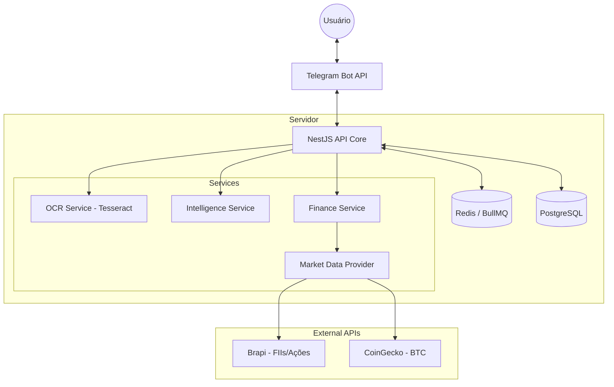
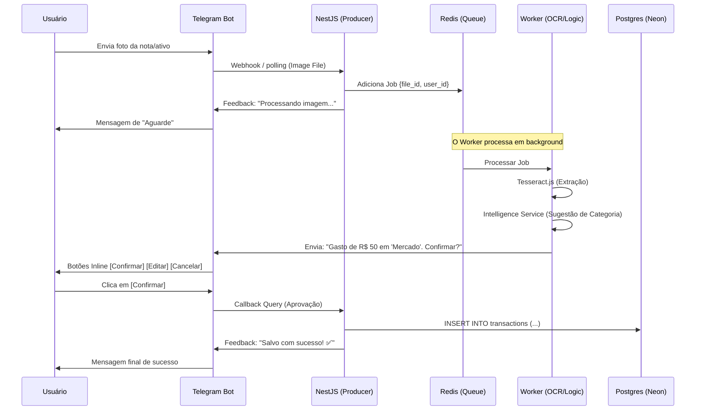

# Definição de Arquitetura

A definição da arquitetura de software deste projeto serve como o blueprint estrutural que orienta o desenvolvimento e a evolução do sistema. Ela estabelece a organização dos componentes, suas responsabilidades e os protocolos de comunicação entre eles. O objetivo principal é garantir que o sistema seja modular, escalável e resiliente, permitindo a separação clara entre a lógica de interface (bot), o processamento intensivo (OCR) e a persistência de dados.

Esta estruturação facilita a manutenção e permite que novos módulos ou integrações com APIs externas sejam adicionados com baixo acoplamento, assegurando a integridade das regras de negócio financeiro.

## Diagrama de Componentes (Visão Geral)

**O que modela:** A organização lógica do sistema, as fronteiras entre o ambiente de execução interno e os serviços externos.

**Como funciona:** O sistema é estruturado em camadas. A camada de interface comunica-se com o núcleo da aplicação (Core), que orquestra os serviços internos através de injeção de dependência. O processamento de dados financeiros consome provedores de dados externos, enquanto as tarefas de processamento de imagem e persistência são isoladas para garantir performance.

## Diagrama de Sequência (Processamento Assíncrono)

**O que modela:** A ordem temporal das mensagens e a interação entre os componentes durante o ciclo de vida de uma requisição de entrada de dados.

**Como funciona:** Demonstra o fluxo desde o recebimento de um arquivo de mídia até a sua confirmação final. O modelo destaca o comportamento não-bloqueante da aplicação: a requisição é recebida, colocada em uma fila de prioridade e processada em background. O ciclo encerra-se apenas após a interação de confirmação do usuário, garantindo a consistência dos dados antes da persistência definitiva no banco de dados.

# Especificação de Arquitetura Modular

**Framework:** NestJS (Node.js)

---

## 1. Visão Geral
O **FinanceBot** é um ecossistema de gestão financeira e de investimentos operado via Telegram. A solução utiliza OCR (Optical Character Recognition) para automação de entradas de gastos e integração com APIs de mercado financeiro para atualização de portfólio de ativos (FIIs e Cripto).

## 2. Padrões de Arquitetura
A aplicação segue o padrão de **Arquitetura Modular do NestJS**, garantindo baixo acoplamento e alta coesão através de Injeção de Dependência e separação clara de domínios.

### 2.1 Princípios Adotados:
* **Separation of Concerns (SoC):** Cada módulo gerencia uma entidade ou funcionalidade específica.
* **Asynchronous Processing:** Tarefas de alto consumo de CPU (OCR) são delegadas a Workers via filas (BullMQ/Redis) para manter a responsividade da interface no Telegram.
* **Multi-tenancy Ready:** Estruturado para suportar múltiplos usuários (como membros da família) isolando os dados pelo `user_id` do Telegram.

---

## 3. Estrutura de Módulos e Responsabilidades

### 3.1 `TelegramModule`
* **Responsabilidade:** Camada de Interface e Comunicação.
* **Funções:**
    * Configuração do engine **Telegraf.js**.
    * Tratamento de comandos (`/start`, `/gastos`, `/investir`).
    * Gestão de `callbacks` para botões inline (Confirmar/Editar).
    * Envio de feedbacks visuais e mensagens de status.

### 3.2 `ExpensesModule` (Gastos)
* **Responsabilidade:** Regras de negócio para saídas financeiras.
* **Funções:**
    * CRUD de transações de gastos mensais.
    * Lógica de categorização e agrupamento para relatórios.

### 3.3 `InvestmentsModule` (Ativos)
* **Responsabilidade:** Gestão de patrimônio e performance.
* **Funções:**
    * Controle de posição (Ticker, Quantidade, Custo).
    * **Cálculo Automático:** Lógica de Preço Médio (PM) e Lucro/Prejuízo (P&L) latente e realizado.

### 3.4 `MarketModule`
* **Responsabilidade:** Gateway de integração com dados externos.
* **Provedores:**
    * **BrapiService:** Consumo de cotações em tempo real para ativos da B3 (FIIs e Ações).
    * **CryptoService (CoinGecko):** Monitoramento de preços de Bitcoin e outras criptomoedas.

### 3.5 `ProcessorModule` (The Worker)
* **Responsabilidade:** Processamento de tarefas pesadas e inteligência de dados.
* **Serviços:**
    * **OCRService:** Orquestração do **Tesseract.js** para extração de texto de imagens.
    * **IntelligenceService:** Algoritmos de Parsing e Pattern Matching (Regex) para identificar valores e sugerir categorias baseadas no histórico do usuário.
* **Fila:** Implementação do **BullMQ** para gerenciar o estado dos Jobs em background.
