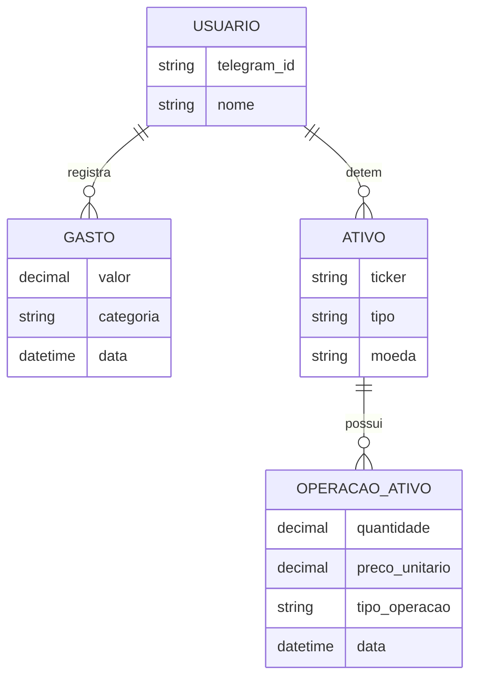
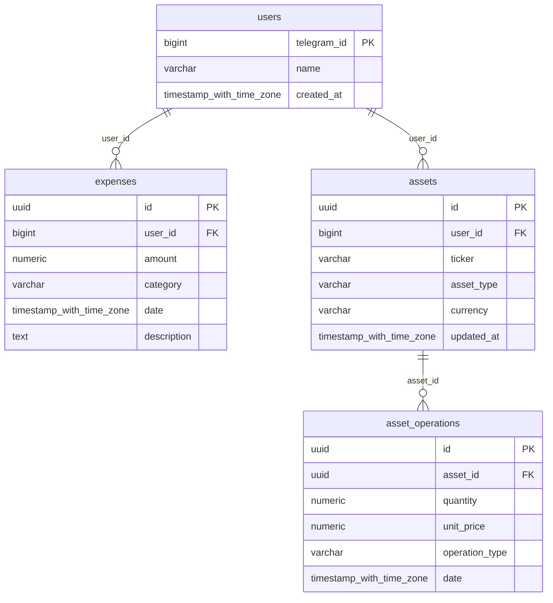

# Modelagem de Dados

A persistência de dados foi projetada para garantir a integridade transacional e a precisão matemática necessária para cálculos financeiros complexos, como o Preço Médio de ativos com alta volatilidade e diferentes casas decimais (ex: Bitcoin).

## Modelo Entidade-Relacionamento (MER)

**O que modela:** As relações conceituais entre as entidades do sistema.

**Como funciona:** O modelo estabelece o usuário como o nó central de isolamento de dados. Cada usuário possui seus próprios registros de gastos e sua carteira de ativos independente. A relação entre ativos e operações permite que o histórico de movimentações seja preservado, possibilitando auditorias e reconstrução de saldos históricos.

## Diagrama Lógico de Dados (DLD)

**O que modela:** A estrutura física das tabelas, chaves primárias (PK), chaves estrangeiras (FK) e os tipos de dados compatíveis com o PostgreSQL e o ambiente de execução NestJS.

**Como funciona:** Utiliza-se o tipo numeric para campos monetários e de quantidade para evitar erros de precisão de ponto flutuante. Chaves do tipo uuid são empregadas para transações, enquanto bigint é utilizado para o identificador do Telegram para suportar a escala numérica da API externa.

## Dicionário de Dados

Abaixo estão detalhadas as restrições e finalidades dos principais atributos do sistema:

| Atributo | Detalhes Técnicos | Descrição |
| :--- | :--- | :--- |
| **expenses.amount** | `DECIMAL(18, 8)` | Valor da transação com precisão para 8 casas decimais. |
| **assets.asset_type** | `VARCHAR` | Classificação do ativo: Ação, FII, Cripto ou ETF. |
| **assets.currency** | `VARCHAR` | Moeda de origem do ativo: BRL ou USD. |
| **asset_operations.operation_type** | `VARCHAR` | Define se a movimentação é de COMPRA ou VENDA. |
